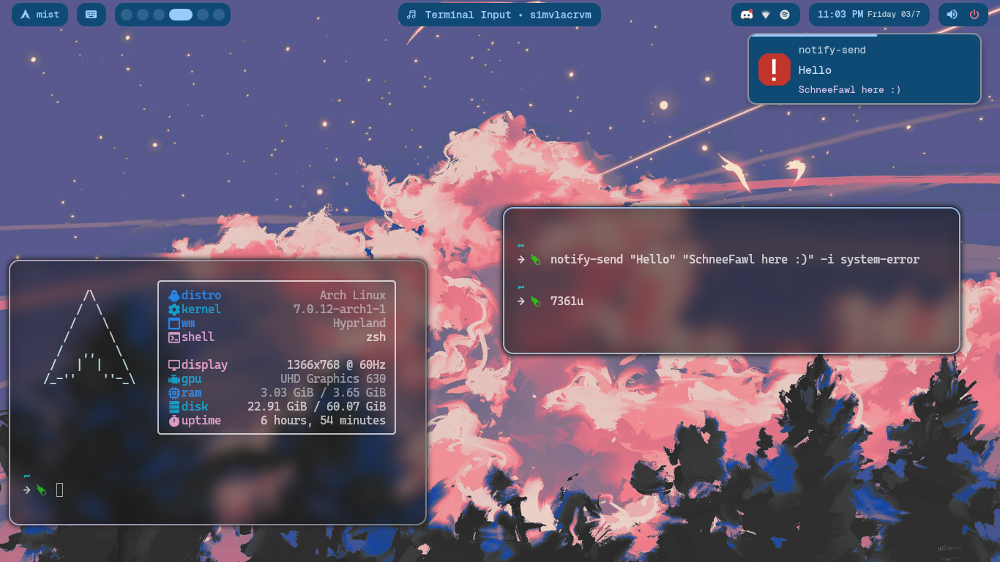
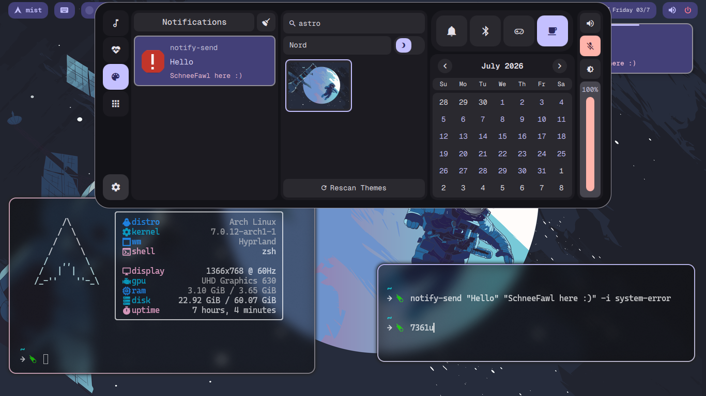

<h1 align="center"> mist-shell</h1>

<div align="center">


</div>

<br>

<div align="center">

Mist-shell is a desktop shell with dotfiles specifically made for Arch Linux. This is a **performance** and **customization** first shell. Mostly contains the shell itself but this also contains a few dotfiles (more coming soon!)

</div>

> [!WARNING]
> This only works for Hyprland 0.55+
> If you haven't updated to Hyprland 0.55 then this won't work for you since hyprlang is deprecated

<details>
    <summary>Installation</summary>

   > **Hyprland 0.54**: If you're using Hyprland version 0.54 or less then you are not ready to use it because this is made only for Hyprland 0.55 or later, which uses the Lua language for config files instead of hyprlang.

  Clone this repo (preferrably in the home directory) and run the install script using `./install.sh`

</details>

<details>
    <summary>Manual Installation</summary>

  > **NOTE**: It is recommended to use a fresh installation of Arch Linux. If not using a fresh installation, make sure to back up your dotfiles.

  - **Clone this repo and enter the directory**
    ```sh
    git clone https://github.com/SchneeFawl/mist-shell.git
    cd mist-shell
    ```

  - **Copy the config files `dots/.config` to your config directory**
    ```sh
    mkdir -p $HOME/.config
    cp -ri dots/.config/. $HOME/.config/
    ```

  - **Install all the pacman dependencies**
    ```sh
    sudo pacman -S --needed \
      hyprland kitty zsh playerctl networkmanager network-manager-applet \
      pavucontrol pipewire pipewire-pulse wireplumber bluez bluez-utils \
      blueman dolphin awww matugen rofi papirus-icon-theme starship \
      cliphist brightnessctl gpu-screen-recorder gamemode qt6-declarative \
      qt6-base qt6-wayland qt6-svg qt6-multimedia qt6-multimedia-ffmpeg \
      qt6-imageformats qt6-shadertools qt6-positioning qt6-webengine \
      libpipewire xdg-desktop-portal-hyprland xdg-desktop-portal-gtk
    ```

  - **Install all the AUR dependencies (replace `yay` with your preferred AUR helper if needed)**:
    ```sh
    yay -S --needed \
      otf-geist-mono-nerd ttf-cascadia-code-nerd ttf-cascadia-mono-nerd \
      quickshell-git bibata-cursor-theme-bin
    ```

</details>

<details>
    <summary>Keybinds</summary>

   - May not be suited to you but here are the list of keybinds if you want to use the ones present in the shell:
        - `SUPER` + `T` = terminal (kitty)
        - `SUPER` + `F` = browser (change browser in `.config/hypr/hyprland/keybinds.lua` if needed)
        - `SUPER` + `C` = editor (code)
        - `SUPER` + `A` = app launcher/menu (rofi)
        - `SUPER` + `E` = open file manager (dolphin)

   - **Hyprland keybinds**:
        - `SUPER` + `Q` = close window
        - `SUPER` + `W` = toggle floating mode
        - `SUPER` + `S` = open special workspace
        - `SUPER` + `P` = toggle pseudo
        - `SUPER` + `M` = shutdown hyprland
        ---
        - `SUPER` + `1` ... `0` = switch workspace from 1 to 10 (0 is the tenth workspace)
        - `SUPER` + `SHIFT` + `1` ... `0` = move window to workspace 1 to 10
        ---
        - `SUPER` + `left` = move focus left
        - `SUPER` + `right` = move focus right
        - `SUPER` + `up` = move focus up
        - `SUPER` + `down` = move focus down
        - `SUPER` + `CTRL` + `left` = navigate to previous workpsace
        - `SUPER` + `CTRL` + `right` = navigate to right workpsace
        ---
        - `SUPER` + `SHIFT` + `left` = move window left
        - `SUPER` + `SHIFT` + `right` = move window right
        - `SUPER` + `SHIFT` + `up` = move window top
        - `SUPER` + `SHIFT` + `down` = move window down
        - `SUPER` + `SHIFT` + `S` = move window special workspace
        ---
</details>

<details>
    <summary>Components</summary>

   - Window manager: [Hyprland](https://hypr.land) (>0.55)
   - Widgets: [Quickshell](https://quickshell.org/)

</details>

---

<h2 align="center">Screenshots</h2>

| Mist theme | Nord theme (dashboard) |
| :--------: | :--------------------: |
|  |  |

---

<h2 align="center">Features</h2>

- [x] Dashboard
- [x] Wallpapers
- [x] Bluetooth
- [x] Clipboard
- [x] Notifications
- [x] DND mode (dashboard)
- [ ] Idle inhibitor/Caffeine mode (half complete)
- [ ] Brightness control (dashboard)
- [x] App launcher
- [x] Screen recorder
- [x] Lock screen
- [ ] Power menu
- [ ] Screenshot

---

<h2 align="center">Why I made this</h2>

<div align="center">

I found that most desktop shells based on Quickshell use a lot of system resources by default. Since I have 4gb ram in my PC, I really don't like high ram usage but I do enjoy aesthetics.

I made this project with a lot of performance aspects in my mind to use the absolute bare minimum system resources. The optimizations in the shell may not be good because I am a beginner to QML and JS overall.

If you want to reach out to me, you can add me on Discord - `schneefawl`. I really want to learn about linux and QML in general.

</div>

<h2 align="center">Support</h2>

- **Bugs** and **Suggestions** - You can open an [issue](https://github.com/SchneeFawl/mist-shell/issues)

---

<h2 align="center">Inspirations and Credits</h2>

- [Ambxst](https://github.com/Axenide/Ambxst) - Quite obvious but this entire project is inspired by [Axenide](https://github.com/Axenide)'s Ambxst shell's design (love this project) 
- [ends-4 dots-hyprland](https://github.com/end-4/dots-hyprland) - Awesome project, mimicked some implementations and learned a lot from it. Found the code quite beginner friendly
- [octashell](https://github.com/octagonemusic/octashell) - Best thing I found on r/QuickShell, very beginner friendly and simple implementations (very grateful to find this)
- [outfoxxed](https://github.com/outfoxxed) - Amazing Quickshell documentation

---

<div align="center">

[GPL-3.0](LICENSE.md)

</div>
